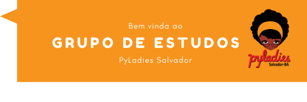

# Grupo de Estudo do Pyladies Salvador

A ideia é construir conjuntamente um conhecimento básico sobre Python, mas que também permita a exploração de aplicações práticas.
Os materiais de cada encontro estão linkados no README da pasta módulos.
